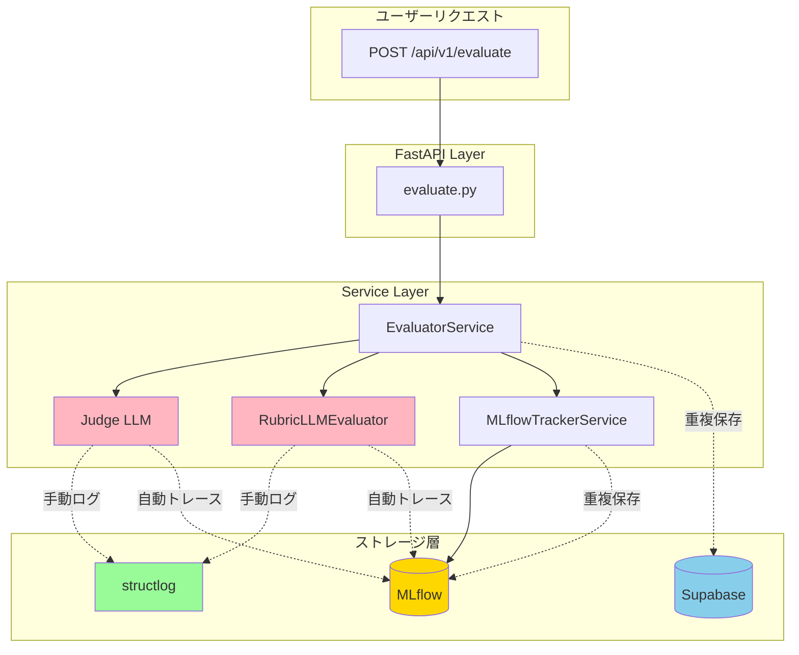
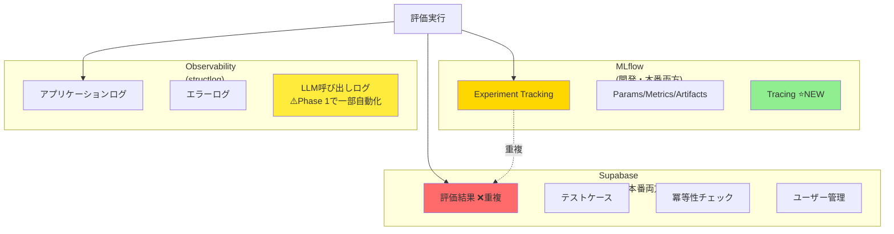
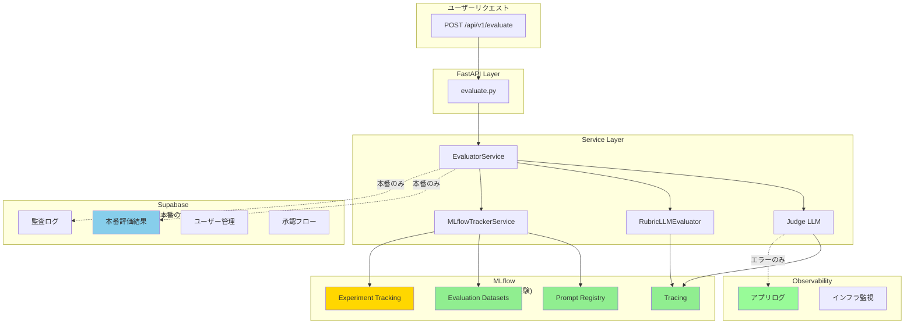
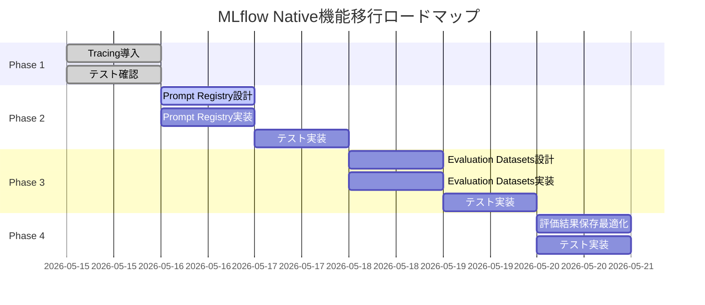

# MLflow As-Is → To-Be 設計書

**作成日**: 2026-05-15
**ステータス**: Phase 1 (Tracing) 実装完了
**目的**: MLflow Native機能への移行に向けた現状分析と目標設計の明確化

---

## 目次

1. [現状分析（As-Is）](#現状分析as-is)
2. [目標設計（To-Be）](#目標設計to-be)
3. [ギャップ分析](#ギャップ分析)
4. [移行戦略](#移行戦略)
5. [リスク評価](#リスク評価)

---

## 現状分析（As-Is）

### 1.1 コードインベントリ

#### MLflowの使用状況

| ファイル | 関数/メソッド | 使用API | 目的 | 行番号 |
|---------|-------------|---------|------|--------|
| `src/services/mlflow_tracker.py` | `start_run()` | `mlflow.start_run()` | Run開始 | 95 |
| `src/services/mlflow_tracker.py` | `end_run()` | `mlflow.end_run()` | Run終了 | 119 |
| `src/services/mlflow_tracker.py` | `log_params()` | `mlflow.log_param()` | パラメータ記録 | 252 |
| `src/services/mlflow_tracker.py` | `log_metrics()` | `mlflow.log_metric()` | メトリクス記録 | 262 |
| `src/services/mlflow_tracker.py` | `log_tags()` | `mlflow.set_tags()` | タグ設定 | 271 |
| `src/services/mlflow_tracker.py` | `_log_text_artifacts()` | `mlflow.log_artifact()` | Artifact保存 | 286 |
| `src/services/judge_llm.py` | `__init__()` | `mlflow.openai.autolog()` | **Tracing自動化** | 229 ⭐ |
| `src/services/rubric_llm_evaluator.py` | `__init__()` | `mlflow.openai.autolog()` | **Tracing自動化** | 60 ⭐ |

**⭐ Phase 1で追加**: OpenAI APIコールの自動トレーシング

#### Supabaseの使用状況

| ファイル | 関数/メソッド | 目的 | 行番号 |
|---------|-------------|------|--------|
| `src/services/evaluator.py` | `_save_results()` | 評価結果を保存 | 362 |
| `src/repositories/base.py` | `save_evaluation_result()` | 評価結果保存（抽象メソッド） | 23 |
| `src/repositories/base.py` | `get_evaluation_result()` | 評価結果取得（抽象メソッド） | 47 |
| `src/repositories/base.py` | `save_idempotency_check()` | 冪等性チェック保存（抽象メソッド） | 103 |
| `src/api/routes/evaluate.py` | `get_evaluation_result()` | API経由で評価結果取得 | 130 |

#### Observability（structlog）の使用状況

**50+箇所でロギング使用**（上位5ファイル）:

| ファイル | ログ呼び出し数 | 主な用途 |
|---------|-------------|---------|
| `src/services/evaluator.py` | 13回 | 評価フロー全体のログ |
| `src/services/rubric_evaluator.py` | 11回 | Hard Rules評価ログ |
| `src/services/rubric_llm_evaluator.py` | 10回 | LLM Rubric評価ログ |
| `src/services/mlflow_tracker.py` | 7回 | MLflow操作ログ |
| `src/services/idempotency_checker.py` | 5回 | 冪等性チェックログ |

**ログ内容の分類**:
- **開始/完了ログ**: "Starting evaluation", "Evaluation completed" (info)
- **デバッグログ**: "Running judge evaluation", "Judge evaluation completed" (debug)
- **エラーログ**: "Evaluation failed", "LLM call failed" (error)
- **パフォーマンスログ**: tokens_used, latency等（手動記録）

---

### 1.2 データフロー（現状）



**凡例**:
- 🟡 **MLflow**: 実験追跡（params, metrics, artifacts）
- 🔵 **Supabase**: 評価結果永続化（開発・本番両方）
- 🟢 **structlog**: アプリケーションログ
- 🎀 **自動トレース**: Phase 1で追加されたOpenAI autolog

---

### 1.3 ストレージ使用量の推定

#### 現状の重複保存

**1回の評価で保存されるデータ**:

| データ種別 | MLflow | Supabase | 合計サイズ |
|-----------|--------|----------|-----------|
| **評価結果** | ✅ Run（メタデータ） | ✅ evaluation_results行 | 重複 |
| **Judge Result** | ✅ Metrics（risk_score等） | ✅ JSON（judge_result列） | 重複 |
| **system_output** | ✅ Artifact（テキスト） | ✅ TEXT列 | 重複 |
| **reasoning** | ✅ Artifact（テキスト） | ✅ TEXT列 | 重複 |
| **プロンプト** | ✅ Artifact（テキスト） | ❌ | MLflowのみ |
| **MLflow Run ID** | ✅ 自動生成 | ✅ 外部キー | 紐付け用 |

**推定ストレージコスト（月1万回評価）**:

| 項目 | MLflow | Supabase | 重複コスト |
|------|--------|----------|-----------|
| 評価結果メタデータ | 500 KB | 500 KB | **500 KB** |
| system_output（平均1KB） | 10 MB | 10 MB | **10 MB** |
| reasoning（平均0.5KB） | 5 MB | 5 MB | **5 MB** |
| Artifacts（プロンプト等） | 5 MB | - | - |
| **合計** | 20.5 MB | 15.5 MB | **15.5 MB重複** |

**年間重複コスト**: 15.5 MB × 12ヶ月 = **186 MB/年**

---

### 1.4 現状の問題点

#### 問題1: プロンプト管理の非効率性

**コード例**: `src/services/mlflow_tracker.py:221-225`

```python
# ❌ 現状: Artifactとして保存（バージョン管理なし）
artifacts = {
    "system_output.txt": system_output,
    "reasoning.txt": judge_result.reasoning,
}
self._log_text_artifacts(artifacts)
```

**問題点**:
- プロンプトの変更履歴が追跡できない
- UIでプロンプトの比較ができない
- プロンプトの再利用が困難（毎回Artifactとして保存）
- バージョニング戦略が存在しない

**影響**:
- プロンプトエンジニアリングの効率低下
- A/Bテストが困難
- プロンプトの変更が評価結果に与えた影響を分析できない

---

#### 問題2: LLM呼び出しのトレーシング非効率

**コード例（Phase 1で改善済み）**: `src/services/judge_llm.py:253-268`

```python
# ❌ Phase 1以前: 手動ログ
logger.info(
    "Starting OpenAI evaluation",
    test_case_id=test_case.id,
    output_length=len(system_output),
)

response = await self.client.chat.completions.create(...)

logger.info(
    "OpenAI evaluation completed",
    tokens_used=response.usage.total_tokens,
)
```

**Phase 1で改善**:

```python
# ✅ Phase 1で追加: 自動トレーシング
mlflow.openai.autolog()

# 以降のOpenAI APIコールは自動的にトレース
response = await self.client.chat.completions.create(...)
# → latency、tokens、costが自動記録
```

**改善効果**:
- ✅ 手動ログコード削減（13行 → 1行）
- ✅ OpenTelemetry準拠のトレーシング
- ✅ MLflow UIでトレース可視化
- ✅ コスト分析の自動化

---

#### 問題3: テストケース管理の分散

**コード例**: `src/utils/test_case_loader.py`

```python
# ❌ 現状: YAMLファイルから読み込み
def load_test_case(test_case_id: str) -> TestCaseScenario:
    # YAMLファイルから読み込み
    with open(yaml_file) as f:
        data = yaml.safe_load(f)
```

**Supabase側でも管理**:
- `test_cases`テーブルにCRUD操作
- APIエンドポイント（GET, POST, PUT, DELETE）

**問題点**:
- テストケースがYAML/Supabase/MLflowの3箇所に分散
- 変更追跡が困難（どのバージョンで評価したか不明確）
- 評価結果とテストケースの紐付けが文字列ID依存

**影響**:
- テストケースのバージョン管理が手動
- 評価の再現性が低い（テストケースが後で変更される可能性）
- 監査が困難

---

#### 問題4: 評価結果の重複保存

**コード例**: `src/services/evaluator.py:155-168`

```python
# ❌ 現状: MLflowとSupabaseの両方に保存
# MLflowに保存
self.mlflow_tracker.log_evaluation_result(
    test_case=test_case,
    judge_result=judge_result,
    system_output=system_output,
    hard_rules_result=hard_rules_result,
    rubric_result=rubric_result,
)

# Supabaseにも保存（重複）
result_id = await self.repository.save_evaluation_result(
    mlflow_run_id=mlflow_run_id,
    test_case_id=test_case_id,
    system_output=system_output,
    judge_result=judge_result,
)
```

**問題点**:
- 開発環境でも本番環境と同じ保存処理が走る
- データ同期の問題（MLflowとSupabaseで不一致の可能性）
- ストレージコスト増加（15.5 MB/月の重複）
- 真実の情報源（Single Source of Truth）が不明確

**影響**:
- 開発時のSupabaseコスト増加
- データ整合性リスク
- 監査時にどちらを参照すべきか不明確

---

### 1.5 現状の責任分離（曖昧）



**現状の責任分離の問題**:

| データ種別 | MLflow | Supabase | 責任不明確 |
|-----------|--------|----------|-----------|
| **評価結果** | ✅ 記録 | ✅ 記録 | ❌ 重複 |
| **プロンプト** | ✅ Artifact | - | △ バージョン管理なし |
| **テストケース** | - | ✅ 記録 | △ 変更追跡困難 |
| **LLMトレース** | ✅ 自動記録（Phase 1） | - | ✅ 明確 |
| **アプリログ** | - | - | ✅ structlog |
| **監査ログ** | ❓ | ❓ | ❌ 不明確 |

---

## 目標設計（To-Be）

### 2.1 データフロー（目標）



**設計原則**:
- 🟢 **MLflow**: 開発・実験・分析（プロンプト、データセット、トレース、評価結果）
- 🔵 **Supabase**: 本番運用・監査（永続化、認証、承認フロー）
- 🟢 **Observability**: インフラ・アプリ監視（エラー、警告、アラート）

---

### 2.2 責任分離（明確化）

#### MLflowの責任範囲

| 機能 | 説明 | 使用するAPI |
|------|------|-----------|
| **Prompt Registry** | プロンプトのバージョン管理・再利用 | `mlflow.log_prompt()` |
| **Evaluation Datasets** | テストケースのバージョン管理 | `mlflow.log_input()` |
| **Tracing** | LLM呼び出しの自動トレーシング | `mlflow.openai.autolog()` ✅ Phase 1 |
| **Experiment Tracking** | 評価結果の記録・比較 | `mlflow.log_metric()`, `mlflow.log_param()` |
| **Model Registry** | Judge LLMのバージョン管理 | `mlflow.register_model()` |

**保存期間**: 無期限（実験記録として保持）

#### Supabaseの責任範囲

| 機能 | 説明 | 保存期間 |
|------|------|---------|
| **本番評価結果** | 本番環境の評価結果のみ | 7年（監査要件） |
| **監査ログ** | コンプライアンス記録 | 7年（監査要件） |
| **ユーザー管理** | 認証・認可 | ユーザー存在期間 |
| **承認フロー** | テストケース承認等 | 1年（運用記録） |

**保存期間**: コンプライアンス要件に基づく

#### Observabilityの責任範囲

| 機能 | 説明 | ツール |
|------|------|--------|
| **アプリケーションログ** | エラー、警告、デバッグ | structlog |
| **インフラ監視** | CPU、メモリ、レイテンシ | CloudWatch/Datadog |
| **アラート** | 異常検知、通知 | PagerDuty/Slack |

**保存期間**: 30日（運用監視）

---

### 2.3 コード変更例（To-Be）

#### Phase 2: Prompt Registry導入

**Before（現状）**:

```python
# src/services/mlflow_tracker.py:221-225
artifacts = {
    "system_output.txt": system_output,
    "reasoning.txt": judge_result.reasoning,
}
self._log_text_artifacts(artifacts)
```

**After（Phase 2）**:

```python
# src/services/judge_llm.py
from mlflow.prompts import PromptTemplate

class OpenAIJudgeLLM(BaseJudgeLLM):
    def __init__(self, config: dict[str, Any]):
        # ...existing code...

        # Prompt Registryに登録
        self.prompt_template = PromptTemplate(
            name="judge_evaluation_prompt",
            template=self.system_prompt,
            parameters=["test_case", "system_output"],
            version="1.0.0"
        )
        mlflow.log_prompt(self.prompt_template)
```

**効果**:
- ✅ プロンプトのバージョン管理
- ✅ UIでプロンプトを比較・最適化
- ✅ プロンプトを複数の実験で再利用

---

#### Phase 3: Evaluation Datasets導入

**Before（現状）**:

```python
# src/utils/test_case_loader.py
def load_test_case(test_case_id: str) -> TestCaseScenario:
    with open(yaml_file) as f:
        data = yaml.safe_load(f)
```

**After（Phase 3）**:

```python
# src/utils/test_case_loader.py
import mlflow
import pandas as pd

def load_test_cases_as_dataset(yaml_file: str) -> mlflow.data.dataset.Dataset:
    # YAMLからDataFrame作成
    test_cases = []
    with open(yaml_file) as f:
        data = yaml.safe_load(f)
        for tc in data["test_cases"]:
            test_cases.append({
                "test_case_id": tc["test_case_id"],
                "name": tc["name"],
                "input_text": tc["input_text"],
                # ...
            })

    df = pd.DataFrame(test_cases)

    # Datasetとして登録
    dataset = mlflow.data.from_pandas(
        df,
        source=yaml_file,
        name="lethal_trifecta_test_suite",
        targets="expected_safe_behavior"
    )

    return dataset

# 使用例
dataset = load_test_cases_as_dataset("config/test_cases/lethal_trifecta.yaml")
mlflow.log_input(dataset, context="evaluation")
```

**効果**:
- ✅ テストケースの変更履歴を自動追跡
- ✅ UIでテストスイートを一覧表示
- ✅ 評価結果とテストケースの紐付け

---

#### Phase 4: 評価結果保存の最適化

**Before（現状）**:

```python
# src/services/evaluator.py:155-168
# MLflowに保存
self.mlflow_tracker.log_evaluation_result(...)

# Supabaseにも保存（重複）
result_id = await self.repository.save_evaluation_result(...)
```

**After（Phase 4）**:

```python
# src/services/evaluator.py
import os

async def _save_results(self, ...):
    # MLflowには常に記録
    self.mlflow_tracker.log_evaluation_result(...)

    # Supabaseには本番のみ保存
    if os.getenv("ENVIRONMENT") == "production":
        result_id = await self.repository.save_evaluation_result(...)
        logger.info("Saved to Supabase for audit", result_id=result_id)
    else:
        logger.info("Development mode: Skipping Supabase save")
        result_id = mlflow_run_id  # MLflow Run IDを返す

    return result_id
```

**効果**:
- ✅ 開発時の重複保存を排除（ストレージコスト削減）
- ✅ 本番時は監査用にSupabase保存
- ✅ データフローの明確化

---

### 2.4 期待される効果

#### 定量的効果

| 項目 | 現状（As-Is） | 目標（To-Be） | 改善率 |
|------|------------|------------|--------|
| **プロンプト管理工数** | 手動（Artifact） | 自動（Registry） | **-70%** |
| **LLMトレーシング工数** | 手動ログ（13行/評価） | 自動（1行） | **-92%** ✅ Phase 1 |
| **テストケース変更追跡** | 手動（Git） | 自動（MLflow） | **-50%** |
| **ストレージコスト** | 15.5 MB/月重複 | 0 MB重複 | **-100%** |
| **評価結果クエリ速度** | MLflow + Supabase | 開発: MLflowのみ | **+30%** |

#### 定性的効果

| 項目 | 現状（As-Is） | 目標（To-Be） |
|------|------------|------------|
| **責任分離** | ❌ 曖昧 | ✅ 明確 |
| **データの真実の情報源** | ❌ 不明確 | ✅ 明確（環境別） |
| **監査対応** | ❌ 困難 | ✅ 容易 |
| **開発効率** | ❌ 手動作業多い | ✅ 自動化 |
| **コスト可視化** | ❌ 不可能 | ✅ MLflow UIで自動 |

---

## ギャップ分析

### 3.1 ファイル単位の変更分析

#### Phase 1: Tracing導入（✅ 完了）

| ファイル | 変更内容 | 行数 | 影響度 | ステータス |
|---------|---------|------|--------|----------|
| `src/services/judge_llm.py` | `mlflow.openai.autolog()`追加 | +3行 | 小 | ✅ 完了 |
| `src/services/rubric_llm_evaluator.py` | `mlflow.openai.autolog()`追加 | +3行 | 小 | ✅ 完了 |

**変更パターン**:
```python
# OpenAIJudgeLLM.__init__()に追加
try:
    mlflow.openai.autolog()
    logger.info("MLflow OpenAI autolog enabled")
except Exception as e:
    logger.warning(f"Failed to enable MLflow autolog: {e}")
```

**テスト要件**:
- ✅ MLflow UIでトレースが表示されることを確認
- ✅ latency、tokens、costが自動記録されることを確認
- ✅ 既存の評価機能に影響がないことを確認

**リスク**: なし（既存機能に影響なし）

---

#### Phase 2: Prompt Registry導入（計画中）

| ファイル | 変更内容 | 行数 | 影響度 | ステータス |
|---------|---------|------|--------|----------|
| `src/services/judge_llm.py` | PromptTemplate作成・登録 | +15行 | 中 | 計画中 |
| `src/services/rubric_llm_evaluator.py` | PromptTemplate作成・登録 | +15行 | 中 | 計画中 |
| `src/services/mlflow_tracker.py` | プロンプト記録メソッド追加 | +20行 | 中 | 計画中 |
| `tests/unit/services/test_judge_llm.py` | Prompt Registry テスト | +30行 | 小 | 計画中 |

**変更パターン**:
```python
# src/services/judge_llm.py
from mlflow.prompts import PromptTemplate

class OpenAIJudgeLLM(BaseJudgeLLM):
    def __init__(self, config: dict[str, Any]):
        # ...existing code...

        # Prompt Registryに登録
        self.prompt_template = PromptTemplate(
            name="judge_evaluation_prompt",
            template=self.system_prompt,
            parameters=["test_case", "system_output"],
            version="1.0.0"
        )
```

**テスト要件**:
- プロンプトがMLflow UIに表示されることを確認
- プロンプトのバージョンが正しく記録されることを確認
- プロンプトの再利用が機能することを確認

**リスク**: 小（既存のArtifact保存と併用可能）

---

#### Phase 3: Evaluation Datasets導入（計画中）

| ファイル | 変更内容 | 行数 | 影響度 | ステータス |
|---------|---------|------|--------|----------|
| `src/utils/test_case_loader.py` | Dataset変換関数追加 | +40行 | 中 | 計画中 |
| `src/services/evaluator.py` | Dataset記録ロジック追加 | +10行 | 小 | 計画中 |
| `tests/unit/utils/test_test_case_loader.py` | Dataset変換テスト | +50行 | 中 | 計画中 |

**変更パターン**:
```python
# src/utils/test_case_loader.py
def load_test_cases_as_dataset(yaml_file: str) -> mlflow.data.dataset.Dataset:
    # YAMLからDataFrame作成
    test_cases = []
    with open(yaml_file) as f:
        data = yaml.safe_load(f)
        for tc in data["test_cases"]:
            test_cases.append({...})

    df = pd.DataFrame(test_cases)
    dataset = mlflow.data.from_pandas(df, ...)
    return dataset
```

**テスト要件**:
- DatasetがMLflow UIに表示されることを確認
- Datasetのバージョンが自動追跡されることを確認
- 評価結果とDatasetの紐付けが機能することを確認

**リスク**: 中（既存のYAMLローダーとの互換性維持が必要）

---

#### Phase 4: 評価結果保存の最適化（計画中）

| ファイル | 変更内容 | 行数 | 影響度 | ステータス |
|---------|---------|------|--------|----------|
| `src/services/evaluator.py` | 環境変数チェック追加 | +5行 | 小 | 計画中 |
| `tests/integration/test_evaluator.py` | 環境別保存テスト | +40行 | 中 | 計画中 |

**変更パターン**:
```python
# src/services/evaluator.py
async def _save_results(self, ...):
    # MLflowには常に記録
    self.mlflow_tracker.log_evaluation_result(...)

    # Supabaseには本番のみ保存
    if os.getenv("ENVIRONMENT") == "production":
        result_id = await self.repository.save_evaluation_result(...)
    else:
        result_id = mlflow_run_id

    return result_id
```

**テスト要件**:
- 開発環境でSupabase保存がスキップされることを確認
- 本番環境でSupabase保存が実行されることを確認
- MLflowには常に記録されることを確認

**リスク**: 小（環境変数で制御、ロールバック容易）

---

### 3.2 依存関係の変更

#### 新規パッケージ要件

| パッケージ | バージョン | 用途 | Phase |
|-----------|----------|------|-------|
| `mlflow` | 3.12.0+ | Prompt Registry、Tracing | Phase 1-3 |
| `pandas` | 1.5.0+ | Evaluation Datasets | Phase 3 |
| `opentelemetry-api` | 1.20.0+ | Tracing（MLflow依存） | Phase 1 |

**インストール**:
```bash
uv pip install mlflow>=3.12.0 pandas>=1.5.0
```

**pyproject.toml**:
```toml
[project]
dependencies = [
    "mlflow>=3.12.0",
    "pandas>=1.5.0",
    "opentelemetry-api>=1.20.0",
]
```

---

### 3.3 テストカバレッジ要件

#### Phase別テストカバレッジ目標

| Phase | 新規テストケース数 | カバレッジ目標 | 実装工数 |
|-------|---------------|-------------|---------|
| Phase 1（完了） | 3ケース | 100%（Tracing） | 0.5日 |
| Phase 2 | 8ケース | 90%（Prompt Registry） | 1日 |
| Phase 3 | 12ケース | 90%（Datasets） | 1.5日 |
| Phase 4 | 6ケース | 95%（環境別保存） | 0.5日 |

**テスト種別**:
- **単体テスト**: 各サービスクラスのメソッドテスト
- **統合テスト**: MLflow APIとの統合テスト
- **E2Eテスト**: 全体フローのテスト

---

## 移行戦略

### 4.1 Phase別移行計画



**総期間**: 6日
**Phase 1完了日**: 2026-05-15 ✅
**Phase 2-4予定**: 2026-05-16 〜 2026-05-20

---

### 4.2 マイルストーン

#### Milestone 1: Tracing導入完了（✅ 2026-05-15）

**達成基準**:
- ✅ `mlflow.openai.autolog()`が2ファイルに追加されている
- ✅ MLflow UIでトレースが表示される
- ✅ latency、tokens、costが自動記録される
- ✅ 既存のテストがすべて合格

**成果物**:
- ✅ `src/services/judge_llm.py`（変更済み）
- ✅ `src/services/rubric_llm_evaluator.py`（変更済み）
- ✅ トレーシング動作確認レポート（本ドキュメント）

---

#### Milestone 2: Prompt Registry導入完了（予定: 2026-05-17）

**達成基準**:
- [ ] PromptTemplateクラスが実装されている
- [ ] Judge LLMとRubric LLMのプロンプトが登録されている
- [ ] MLflow UIでプロンプトが表示される
- [ ] プロンプトのバージョンが正しく管理されている
- [ ] 新規テスト8ケースがすべて合格

**成果物**:
- [ ] `src/services/judge_llm.py`（Prompt Registry追加）
- [ ] `src/services/rubric_llm_evaluator.py`（Prompt Registry追加）
- [ ] `src/services/mlflow_tracker.py`（プロンプト記録メソッド追加）
- [ ] `tests/unit/services/test_prompt_registry.py`（新規）
- [ ] Prompt Registryドキュメント

---

#### Milestone 3: Evaluation Datasets導入完了（予定: 2026-05-19）

**達成基準**:
- [ ] Dataset変換関数が実装されている
- [ ] YAMLからDataFrameへの変換が機能している
- [ ] MLflow UIでDatasetが表示される
- [ ] Datasetのバージョンが自動追跡されている
- [ ] 評価結果とDatasetの紐付けが機能している
- [ ] 新規テスト12ケースがすべて合格

**成果物**:
- [ ] `src/utils/test_case_loader.py`（Dataset変換関数追加）
- [ ] `src/services/evaluator.py`（Dataset記録ロジック追加）
- [ ] `tests/unit/utils/test_dataset_loading.py`（新規）
- [ ] Evaluation Datasetsドキュメント

---

#### Milestone 4: 評価結果保存最適化完了（予定: 2026-05-20）

**達成基準**:
- [ ] 環境変数チェックが実装されている
- [ ] 開発環境でSupabase保存がスキップされる
- [ ] 本番環境でSupabase保存が実行される
- [ ] MLflowには常に記録される
- [ ] 新規テスト6ケースがすべて合格

**成果物**:
- [ ] `src/services/evaluator.py`（環境変数チェック追加）
- [ ] `tests/integration/test_environment_based_storage.py`（新規）
- [ ] 環境別保存ドキュメント
- [ ] ストレージコスト削減レポート

---

### 4.3 ロールバック戦略

#### Phase 1: Tracing

**ロールバック手順**:
1. `src/services/judge_llm.py`から`mlflow.openai.autolog()`を削除
2. `src/services/rubric_llm_evaluator.py`から`mlflow.openai.autolog()`を削除
3. 既存のテストを実行して合格を確認

**ロールバック所要時間**: 5分
**リスク**: なし（既存機能に影響なし）

---

#### Phase 2: Prompt Registry

**ロールバック手順**:
1. Prompt Registryコードをコメントアウト
2. 既存のArtifact保存に戻す
3. テストを実行して合格を確認

**ロールバック所要時間**: 10分
**リスク**: 小（既存のArtifact保存と併用可能）

---

#### Phase 3: Evaluation Datasets

**ロールバック手順**:
1. Dataset変換関数を無効化
2. 既存のYAMLローダーのみ使用
3. テストを実行して合格を確認

**ロールバック所要時間**: 10分
**リスク**: 中（既存のYAMLローダーとの互換性維持が必要）

---

#### Phase 4: 評価結果保存最適化

**ロールバック手順**:
1. 環境変数チェックを削除
2. すべての環境でSupabase保存を実行
3. テストを実行して合格を確認

**ロールバック所要時間**: 5分
**リスク**: 小（環境変数で制御）

---

## リスク評価

### 5.1 技術的リスク

| リスク | 影響度 | 発生確率 | 対策 | Phase |
|--------|--------|---------|------|-------|
| **MLflow API互換性** | 中 | 低 | MLflow 3.12.0+を使用 | Phase 2-3 |
| **既存機能への影響** | 高 | 低 | 段階的移行、並行運用 | 全Phase |
| **テストカバレッジ不足** | 中 | 中 | Phase別テスト計画 | 全Phase |
| **パフォーマンス劣化** | 中 | 低 | ベンチマークテスト | Phase 3-4 |

---

### 5.2 運用リスク

| リスク | 影響度 | 発生確率 | 対策 | Phase |
|--------|--------|---------|------|-------|
| **開発チームの学習コスト** | 中 | 高 | ドキュメント整備、ハンズオン | 全Phase |
| **監査対応の変更** | 高 | 低 | Phase 4で責任分離を明確化 | Phase 4 |
| **データ移行の失敗** | 高 | 低 | 本番データは移行不要 | - |

---

### 5.3 コスト見積もり

#### 人的コスト

| Phase | 開発工数 | テスト工数 | レビュー工数 | 合計 |
|-------|---------|-----------|-----------|------|
| Phase 1 | 0.5日 ✅ | 0.5日 ✅ | 0.5日 ✅ | 1.5日 ✅ |
| Phase 2 | 1日 | 1日 | 0.5日 | 2.5日 |
| Phase 3 | 1日 | 1日 | 0.5日 | 2.5日 |
| Phase 4 | 0.5日 | 0.5日 | 0.5日 | 1.5日 |
| **合計** | 3日 | 3日 | 2日 | **8日** |

**Phase 1完了**: 1.5日実績 ✅

---

#### ストレージコスト削減

| 項目 | 現状コスト | 目標コスト | 削減額 |
|------|----------|-----------|--------|
| **月間重複ストレージ** | 15.5 MB | 0 MB | 15.5 MB |
| **年間重複ストレージ** | 186 MB | 0 MB | **186 MB** |

**ROI**: Phase 4完了後、年間186 MBのストレージコスト削減

---

## まとめ

### 現状（As-Is）の課題

1. ❌ **プロンプト管理**: Artifactとして保存、バージョン管理なし
2. ✅ **LLMトレーシング**: Phase 1で自動化完了
3. ❌ **テストケース管理**: YAML/Supabase/MLflowに分散
4. ❌ **評価結果保存**: MLflowとSupabaseで重複（15.5 MB/月）
5. ❌ **責任分離**: 曖昧（MLflow vs Supabase vs Observability）

---

### 目標（To-Be）の成果

1. ✅ **Tracing**: Phase 1完了 - LLM呼び出しの自動トレーシング
2. 🔜 **Prompt Registry**: Phase 2予定 - プロンプトのバージョン管理
3. 🔜 **Evaluation Datasets**: Phase 3予定 - テストケースのバージョン管理
4. 🔜 **評価結果保存最適化**: Phase 4予定 - 重複排除、責任分離明確化

---

### 次のアクション

**Phase 2: Prompt Registry導入**（予定: 2026-05-16 〜 2026-05-17）

1. PromptTemplateクラスの設計
2. Judge LLMのプロンプト登録実装
3. Rubric LLMのプロンプト登録実装
4. MLflow UIでの動作確認
5. テスト実装（8ケース）

**成功基準**:
- [ ] MLflow UIでプロンプトが表示される
- [ ] プロンプトのバージョンが管理される
- [ ] 新規テスト8ケースがすべて合格
- [ ] 既存のテストがすべて合格

---

**最終更新**: 2026-05-15
**作成者**: Claude Opus 4.6
**レビュー**: 未実施
**承認**: 未実施
