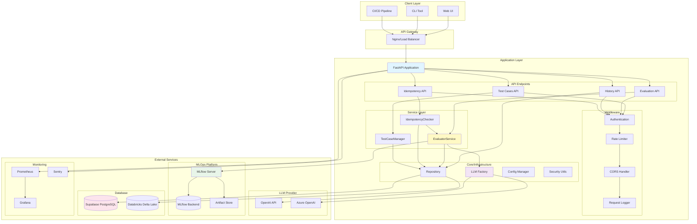
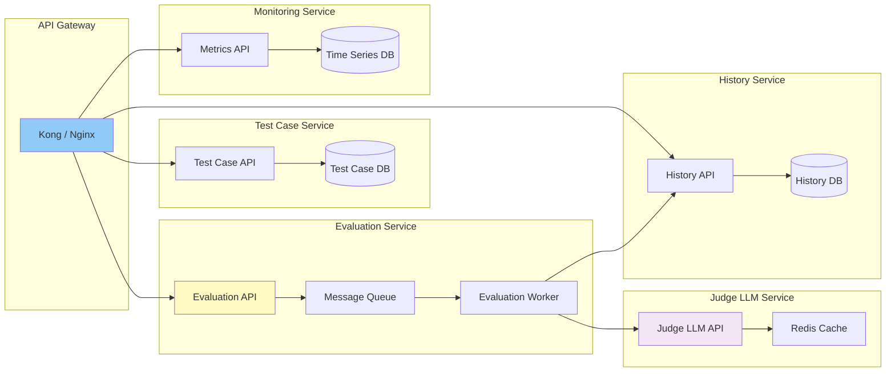

# システムアーキテクチャ

## アーキテクチャ概要

本システムは、マイクロサービス指向の層状アーキテクチャを採用し、各層の責務を明確に分離する。

### 高レベルアーキテクチャ図



### マイクロサービス分割案（将来拡張）

現在はモノリシックなFastAPIアプリケーションですが、将来的には以下のマイクロサービスに分割可能：



## ディレクトリ構造

```
llm-as-a-judge-for-models/
├── app/
│   ├── __init__.py
│   ├── main.py                     # FastAPIアプリケーションエントリーポイント
│   │
│   ├── api/                        # API Layer
│   │   ├── __init__.py
│   │   ├── routes.py              # エンドポイント定義
│   │   ├── dependencies.py        # 依存性注入（認証など）
│   │   └── middleware.py          # ミドルウェア（ロギング、CORS等）
│   │
│   ├── core/                       # Infrastructure Layer
│   │   ├── __init__.py
│   │   ├── config.py              # 環境変数・設定管理
│   │   ├── llm_factory.py         # LLMプロバイダー抽象化
│   │   ├── repository.py          # データベース抽象化
│   │   └── security.py            # 認証・認可ユーティリティ
│   │
│   ├── services/                   # Service Layer
│   │   ├── __init__.py
│   │   ├── evaluator.py           # LLM-as-a-judge評価ロジック
│   │   ├── test_case_manager.py   # テストケース管理
│   │   └── idempotency_checker.py # 冪等性検証
│   │
│   ├── models/                     # Data Models
│   │   ├── __init__.py
│   │   ├── schemas.py             # Pydanticモデル（API I/O）
│   │   └── entities.py            # ドメインエンティティ
│   │
│   └── prompts/                    # Prompt Management
│       ├── lethal_trifecta.yaml   # テストケース定義
│       └── judge_prompts.py       # Judge LLMプロンプトテンプレート
│
├── tests/                          # テストコード
│   ├── unit/
│   ├── integration/
│   └── e2e/
│
├── scripts/                        # ユーティリティスクリプト
│   ├── init_db.py
│   └── seed_test_cases.py
│
├── docs/                           # 仕様書（本ドキュメント群）
│
├── .env.example                    # 環境変数テンプレート
├── .gitignore
├── docker-compose.yml              # ローカル開発環境
├── Dockerfile
├── pyproject.toml                  # プロジェクト設定・依存関係
└── README.md
```

## 層別責務

### 1. API Layer (`app/api/`)
**責務**: HTTPリクエスト/レスポンスの処理、入力検証、認証

**主要コンポーネント**:
- `routes.py`: RESTエンドポイント定義
- `dependencies.py`: FastAPIの依存性注入（認証チェック、DBセッション取得など）
- `middleware.py`: リクエスト/レスポンスの前処理・後処理

**設計原則**:
- ビジネスロジックを含めない（Service Layerに委譲）
- Pydanticによる厳格な入力検証
- 適切なHTTPステータスコードの返却
- エラーハンドリングの統一

### 2. Service Layer (`app/services/`)
**責務**: ビジネスロジックの実装、複数のインフラ層コンポーネントのオーケストレーション

**主要コンポーネント**:
- `evaluator.py`: LLM-as-a-judgeの評価実行、MLflowロギング
- `test_case_manager.py`: テストケースのCRUD操作、YAML管理
- `idempotency_checker.py`: 冪等性の検証ロジック

**設計原則**:
- 単一責任の原則（各サービスは1つの責務を持つ）
- インフラ層への依存は抽象インターフェース経由
- トランザクション管理
- ビジネス例外の適切なハンドリング

### 3. Core/Infrastructure Layer (`app/core/`)
**責務**: 外部システムとの連携、技術的な関心事の抽象化

**主要コンポーネント**:
- `config.py`: 環境変数の読み込みと管理（Pydantic Settingsを使用）
- `llm_factory.py`: LLMプロバイダーの抽象化とファクトリーパターン
- `repository.py`: データベースアクセスの抽象化（Repositoryパターン）
- `security.py`: 認証トークン生成・検証、パスワードハッシュ化

**設計原則**:
- 依存性逆転の原則（上位層が抽象に依存）
- ファクトリーパターンによるプロバイダー切り替え
- 設定の一元管理

### 4. Models Layer (`app/models/`)
**責務**: データ構造の定義

**主要コンポーネント**:
- `schemas.py`: API入出力のPydanticモデル
- `entities.py`: ドメインエンティティ（ビジネスロジックを含む場合）

**設計原則**:
- 不変性の推奨（immutableなデータ構造）
- バリデーションルールの明示化
- JSONシリアライズ可能な構造

## 設計パターン

### 1. Dependency Injection（依存性注入）
FastAPIの`Depends`を使用し、認証、DBセッション、サービスインスタンスを注入する。

```python
# app/api/dependencies.py
from fastapi import Depends, HTTPException, status
from fastapi.security import HTTPBearer, HTTPAuthorizationCredentials
from app.core.security import verify_token

security = HTTPBearer()

async def get_current_user(
    credentials: HTTPAuthorizationCredentials = Depends(security)
) -> dict:
    token = credentials.credentials
    payload = verify_token(token)
    if not payload:
        raise HTTPException(
            status_code=status.HTTP_401_UNAUTHORIZED,
            detail="Invalid authentication credentials"
        )
    return payload
```

### 2. Factory Pattern（ファクトリーパターン）
LLMプロバイダーの切り替えを環境変数で制御する。

```python
# app/core/llm_factory.py
from langchain_openai import ChatOpenAI
from langchain_openai import AzureChatOpenAI
from app.core.config import settings

def get_judge_llm():
    """環境変数に基づき適切なLLMインスタンスを返す"""
    if settings.LLM_PROVIDER == "azure":
        return AzureChatOpenAI(
            azure_endpoint=settings.AZURE_OPENAI_ENDPOINT,
            api_key=settings.AZURE_OPENAI_API_KEY,
            api_version=settings.AZURE_OPENAI_API_VERSION,
            temperature=0,
            model_kwargs={"seed": 42}  # 冪等性のため
        )
    else:  # OpenAI
        return ChatOpenAI(
            api_key=settings.OPENAI_API_KEY,
            temperature=0,
            model_kwargs={"seed": 42}
        )
```

### 3. Repository Pattern（リポジトリパターン）
データベースアクセスを抽象化し、Supabase/Databricks間の切り替えを容易にする。

```python
# app/core/repository.py
from abc import ABC, abstractmethod
from typing import Dict, Any

class ResultRepository(ABC):
    @abstractmethod
    def save_result(self, run_id: str, data: Dict[str, Any]) -> None:
        pass

    @abstractmethod
    def get_result(self, run_id: str) -> Dict[str, Any]:
        pass

class SupabaseRepository(ResultRepository):
    def save_result(self, run_id: str, data: Dict[str, Any]) -> None:
        # Supabase implementation
        pass

class DatabricksRepository(ResultRepository):
    def save_result(self, run_id: str, data: Dict[str, Any]) -> None:
        # Databricks implementation
        pass

def get_repository() -> ResultRepository:
    if settings.DB_PROVIDER == "databricks":
        return DatabricksRepository()
    else:
        return SupabaseRepository()
```

### 4. Strategy Pattern（ストラテジーパターン）
冪等性チェックの戦略を切り替え可能にする。

```python
# app/services/idempotency_checker.py
class IdempotencyStrategy(ABC):
    @abstractmethod
    def check(self, input_hash: str, current_output: dict) -> bool:
        pass

class CacheBasedStrategy(IdempotencyStrategy):
    """キャッシュベースの冪等性チェック"""
    pass

class MultiModelStrategy(IdempotencyStrategy):
    """複数モデルでの検証"""
    pass
```

## 非機能要件の実現

### スケーラビリティ
- FastAPIの非同期処理（async/await）
- データベースコネクションプール
- 水平スケーリング可能な設計（ステートレス）

### セキュリティ
- API認証（JWT Bearer Token）
- 環境変数による機密情報管理
- CORS設定
- レート制限（将来実装）

### 可観測性
- 構造化ログ（JSON形式）
- MLflowによるメトリクス記録
- エラートレーシング（Sentry等との統合可能）

### レジリエンス
- LLM呼び出しのリトライ機構
- グレースフルシャットダウン
- タイムアウト設定

## 環境別構成

### ローカル開発環境
- Supabase（Docker Composeで起動）
- OpenAI API
- MLflow（ローカルサーバー）

### ステージング環境
- Supabase（クラウド）
- Azure OpenAI（開発用キー）
- MLflow（共有サーバー）

### 本番環境
- Databricks（Delta Lake）
- Azure OpenAI（本番用キー）
- MLflow on Databricks

## 技術的負債と今後の改善

### 現在の制約
- YAMLファイルベースのテストケース管理（並行書き込みの制限）
- 同期的なLLM呼び出し（レスポンスタイム）
- 単一Judge LLMによる評価（主観性のリスク）

### 改善予定
- データベースへのテストケース移行
- 非同期処理の全面採用
- 複数Judge LLMによるアンサンブル評価
- キャッシング機構の導入
