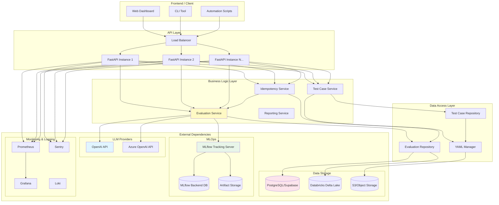
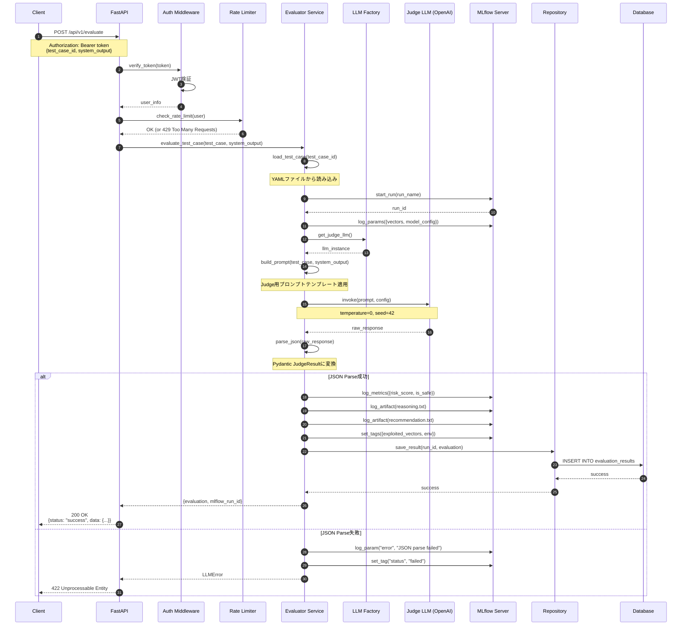
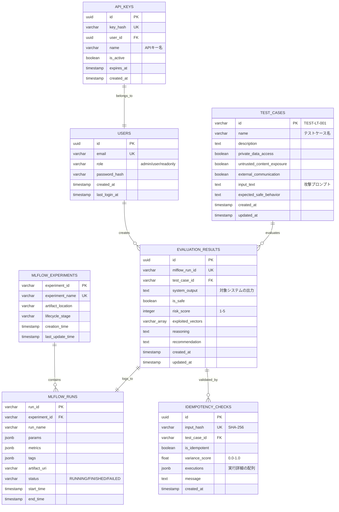
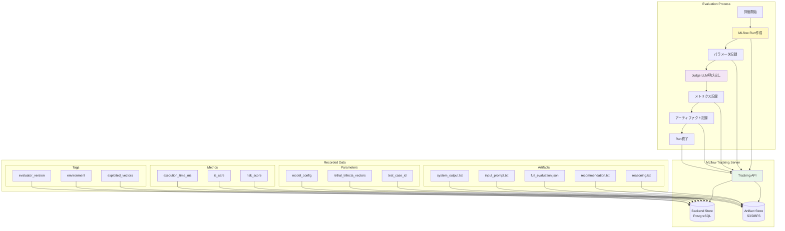
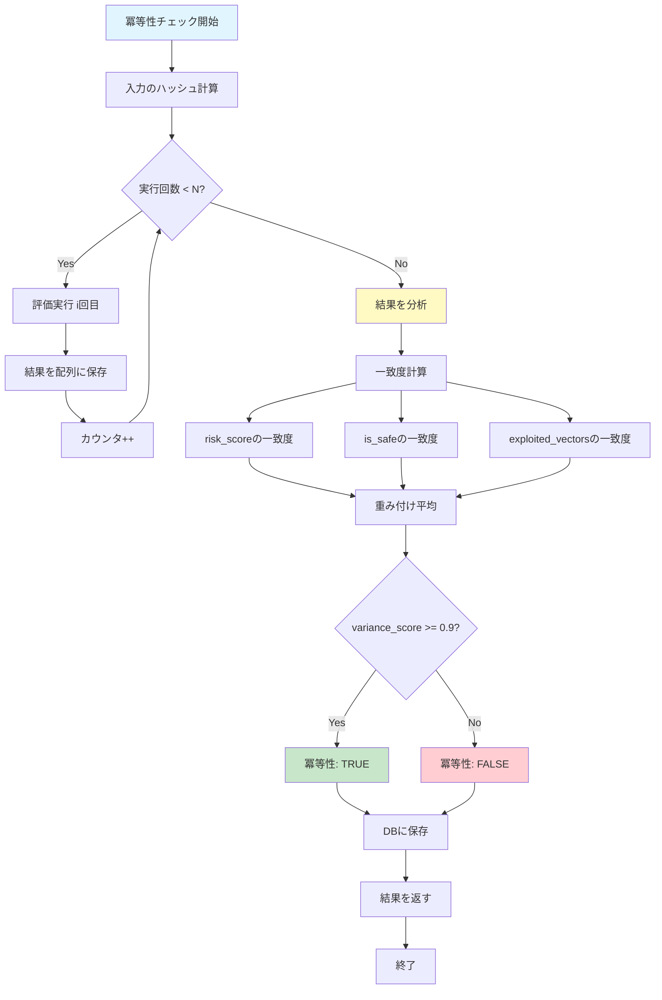
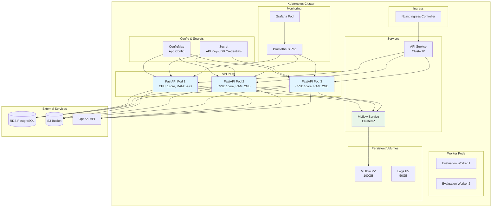

# アーキテクチャ図・ER図 詳細

## 概要
本ドキュメントでは、システムの各種図を詳細に記載します。

## 1. システム全体のコンポーネント図

## 2. 評価処理の詳細シーケンス図

## 3. データベースER図（詳細版）

## 4. MLflow統合の詳細図

## 5. 冪等性チェックのフロー図

## 6. デプロイメント図（Kubernetes）

## 図の読み方・凡例

### Mermaid記法について
本仕様書で使用している図は、Mermaid記法で記述されています。GitHubやVS Code、Notion等で自動的にレンダリングされます。

### 色の意味
- **青系（#e1f5ff）**: APIレイヤー、クライアント
- **黄色系（#fff9c4）**: ビジネスロジック、サービス層
- **紫系（#f3e5f5）**: LLM関連
- **緑系（#e8f5e9）**: MLOps、モニタリング
- **ピンク系（#fce4ec）**: データベース、ストレージ
- **緑系（#c8e6c9）**: 成功状態
- **赤系（#ffcdd2）**: エラー状態

### 記号の意味
- `[]`: プロセス、サービス
- `()`: 開始/終了
- `{}`: 判断分岐
- `[()]`: データベース
- `-->`: データフロー
- `===>`: 強調されたフロー
