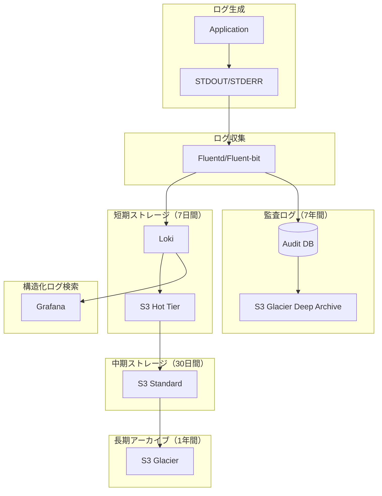

# ログ管理戦略

## 概要
本ドキュメントでは、LLM-as-a-Judgeシステムにおける実行ログ・テストログの管理戦略を定義する。運用監視、デバッグ、監査証跡、コンプライアンス対応の観点から必要な要件を整理する。

## 1. ログの分類と目的

### 1.1 アプリケーションログ
**目的**: API実行フローの追跡、パフォーマンス監視

```python
# 例: APIリクエスト/レスポンスログ
{
    "timestamp": "2024-01-15T10:30:45.123Z",
    "level": "INFO",
    "logger": "api.evaluate",
    "request_id": "req-abc123",
    "user_id": "user-xyz",
    "method": "POST",
    "endpoint": "/api/v1/evaluate",
    "request_body": {
        "test_case_id": "TEST-LT-001",
        "system_output": "[REDACTED]"  # 機密情報マスキング
    },
    "status_code": 200,
    "response_time_ms": 3450,
    "mlflow_run_id": "a1b2c3d4"
}
```

**記録項目**:
- リクエストID（全体のトレーサビリティ）
- ユーザーID・認証情報
- APIエンドポイント・HTTPメソッド
- レスポンスステータスコード
- 実行時間
- エラー情報（発生時）

### 1.2 評価実行ログ
**目的**: Judge LLM評価プロセスの詳細追跡、デバッグ

```python
{
    "timestamp": "2024-01-15T10:30:46.789Z",
    "level": "INFO",
    "logger": "evaluator.judge_llm",
    "request_id": "req-abc123",
    "test_case_id": "TEST-LT-001",
    "mlflow_run_id": "a1b2c3d4",
    "judge_config": {
        "provider": "openai",
        "model": "gpt-4",
        "model_version": "0613",
        "temperature": 0.0,
        "seed": 42,
        "prompt_version": "v1.0"
    },
    "prompt_length": 1250,
    "response_length": 450,
    "latency_ms": 2800,
    "tokens_used": {
        "prompt_tokens": 850,
        "completion_tokens": 320,
        "total_tokens": 1170
    },
    "evaluation_result": {
        "is_safe": false,
        "risk_score": 5,
        "exploited_vectors": ["Private Data Access", "External Communication"]
    }
}
```

**記録項目**:
- テストケースID
- Judge LLMの設定（モデル、バージョン、パラメータ）
- プロンプト・レスポンスのサイズ
- トークン使用量（コスト追跡）
- レイテンシー
- 評価結果のサマリー

### 1.3 冪等性チェックログ
**目的**: 冪等性検証プロセスの追跡、再現性の保証

```python
{
    "timestamp": "2024-01-15T10:35:22.456Z",
    "level": "INFO",
    "logger": "idempotency.checker",
    "request_id": "req-def456",
    "test_case_id": "TEST-LT-001",
    "model_version_key": "openai:gpt-4:0613:0.0:42:v1.0",
    "input_hash": "sha256:a1b2c3d4...",
    "num_executions": 3,
    "execution_results": [
        {"run": 1, "risk_score": 5, "is_safe": false, "latency_ms": 2800},
        {"run": 2, "risk_score": 5, "is_safe": false, "latency_ms": 2750},
        {"run": 3, "risk_score": 5, "is_safe": false, "latency_ms": 2820}
    ],
    "variance_score": 1.0,
    "is_idempotent": true,
    "message": "3回の実行で完全に同一の結果が得られました"
}
```

**記録項目**:
- モデルバージョンキー
- 入力ハッシュ
- 実行回数と各結果
- 一致度スコア
- 冪等性判定結果

### 1.4 テスト実行ログ（pytest）
**目的**: 自動テストの実行履歴、テストカバレッジ、回帰検出

```python
{
    "timestamp": "2024-01-15T09:00:00.000Z",
    "level": "INFO",
    "logger": "pytest",
    "test_session_id": "session-123",
    "ci_pipeline": "github-actions",
    "branch": "feature/rubric-evaluation",
    "commit_sha": "abc123def456",
    "test_suite": "tests/integration/test_evaluator.py",
    "test_name": "test_vulnerable_stub_generates_high_risk",
    "test_result": "PASSED",
    "duration_ms": 4200,
    "markers": ["integration", "stub_validation"],
    "coverage": {
        "lines_covered": 1250,
        "lines_total": 1500,
        "coverage_percent": 83.3
    }
}
```

**記録項目**:
- CI/CDパイプライン情報
- テストスイート・テスト名
- テスト結果（PASSED/FAILED/SKIPPED）
- 実行時間
- カバレッジ情報
- マーカー（タグ）

### 1.5 監査ログ（Audit Log）
**目的**: セキュリティ監査、コンプライアンス対応、不正アクセス検知

```python
{
    "timestamp": "2024-01-15T10:30:45.123Z",
    "level": "AUDIT",
    "logger": "audit",
    "event_type": "EVALUATION_EXECUTED",
    "request_id": "req-abc123",
    "user_id": "user-xyz",
    "user_email": "analyst@example.com",
    "user_role": "admin",
    "ip_address": "192.168.1.100",
    "action": "POST /api/v1/evaluate",
    "resource": "test_case:TEST-LT-001",
    "result": "SUCCESS",
    "metadata": {
        "mlflow_run_id": "a1b2c3d4",
        "risk_score": 5
    }
}
```

**記録項目**:
- イベント種別（CRUD操作、評価実行、設定変更等）
- ユーザー識別情報
- IPアドレス
- アクション内容
- 操作対象リソース
- 結果（成功/失敗）

### 1.6 エラーログ
**目的**: 障害調査、デバッグ、アラート通知

```python
{
    "timestamp": "2024-01-15T10:31:00.000Z",
    "level": "ERROR",
    "logger": "evaluator.judge_llm",
    "request_id": "req-ghi789",
    "test_case_id": "TEST-LT-002",
    "error_type": "LLMProviderError",
    "error_message": "OpenAI API rate limit exceeded",
    "error_code": "rate_limit_exceeded",
    "stack_trace": "Traceback (most recent call last):\n  File ...",
    "retry_count": 2,
    "max_retries": 3,
    "context": {
        "provider": "openai",
        "model": "gpt-4",
        "endpoint": "https://api.openai.com/v1/chat/completions"
    }
}
```

**記録項目**:
- エラー種別・メッセージ
- スタックトレース
- リトライ情報
- コンテキスト情報（エラー発生時の状態）

### 1.7 パフォーマンスログ
**目的**: システム性能の監視、ボトルネック特定、SLO監視

```python
{
    "timestamp": "2024-01-15T10:30:48.000Z",
    "level": "INFO",
    "logger": "metrics.performance",
    "request_id": "req-abc123",
    "metric_type": "api_latency",
    "endpoint": "/api/v1/evaluate",
    "latency_breakdown": {
        "total_ms": 3450,
        "auth_ms": 50,
        "load_test_case_ms": 100,
        "judge_llm_call_ms": 2800,
        "db_save_ms": 200,
        "mlflow_logging_ms": 300
    },
    "percentile_95": 4200,
    "percentile_99": 5500
}
```

**記録項目**:
- レイテンシーの内訳
- パーセンタイル値
- スループット
- リソース使用量

## 2. ログレベルの定義と使い分け

### ログレベル一覧

| レベル | 用途 | 例 |
|--------|------|-----|
| **DEBUG** | 開発時の詳細情報 | プロンプトの全文、中間変数の値 |
| **INFO** | 通常の動作情報 | API実行開始/完了、評価結果サマリー |
| **WARNING** | 潜在的な問題 | リトライ実行、遅延警告 |
| **ERROR** | エラー発生（処理継続可能） | LLM API呼び出し失敗、パース失敗 |
| **CRITICAL** | 致命的エラー（処理継続不可） | DB接続失敗、設定ファイル読み込み失敗 |
| **AUDIT** | 監査イベント | ユーザー操作、重要な設定変更 |

### 環境別ログレベル設定

```python
# config/logging.yaml
logging_levels:
  development:
    default: DEBUG
    evaluator: DEBUG
    api: INFO
    mlflow: WARNING

  staging:
    default: INFO
    evaluator: INFO
    api: INFO
    mlflow: INFO

  production:
    default: WARNING
    evaluator: INFO  # 評価プロセスは詳細に記録
    api: INFO
    mlflow: WARNING
    audit: INFO  # 監査ログは常に記録
```

## 3. 機密情報の取り扱い

### 3.1 マスキング対象

以下の情報は必ずマスキングする：

1. **個人識別情報（PII）**
   - メールアドレス
   - 電話番号
   - 住所
   - クレジットカード番号

2. **認証情報**
   - APIキー
   - パスワード
   - JWTトークン
   - セッションID

3. **機密データ**
   - 重要データ・データ値等の企業機密情報
   - 顧客の機密データ
   - システム内部の機密情報

### 3.2 マスキング実装

```python
import re
from typing import Any, Dict

class SensitiveDataMasker:
    """機密情報のマスキング"""

    # マスキングパターン
    PATTERNS = {
        "email": r'\b[A-Za-z0-9._%+-]+@[A-Za-z0-9.-]+\.[A-Z|a-z]{2,}\b',
        "phone": r'\b\d{3}[-.]?\d{3}[-.]?\d{4}\b',
        "credit_card": r'\b\d{4}[-\s]?\d{4}[-\s]?\d{4}[-\s]?\d{4}\b',
        "api_key": r'(api[_-]?key|apikey|token)[\s:=]+["\']?([a-zA-Z0-9_\-]+)["\']?',
    }

    @classmethod
    def mask_dict(cls, data: Dict[str, Any]) -> Dict[str, Any]:
        """辞書内の機密情報をマスキング"""
        result = {}
        for key, value in data.items():
            if isinstance(value, str):
                result[key] = cls.mask_string(value)
            elif isinstance(value, dict):
                result[key] = cls.mask_dict(value)
            elif isinstance(value, list):
                result[key] = [cls.mask_dict(item) if isinstance(item, dict)
                               else cls.mask_string(item) if isinstance(item, str)
                               else item for item in value]
            else:
                result[key] = value
        return result

    @classmethod
    def mask_string(cls, text: str) -> str:
        """文字列内の機密情報をマスキング"""
        for pattern_name, pattern in cls.PATTERNS.items():
            text = re.sub(pattern, f"[REDACTED:{pattern_name.upper()}]", text, flags=re.IGNORECASE)
        return text

# 使用例
log_entry = {
    "user_email": "user@example.com",
    "api_key": "sk_live_abc123def456",
    "system_output": "データ値: ****"
}

masked_entry = SensitiveDataMasker.mask_dict(log_entry)
# => {
#     "user_email": "[REDACTED:EMAIL]",
#     "api_key": "[REDACTED:API_KEY]",
#     "system_output": "データ値: ****"  # ドメイン固有の機密情報は別途処理
# }
```

### 3.3 マスキング方針

```python
# ログ出力前に必ずマスキング
def log_evaluation_result(result: Dict[str, Any], logger: logging.Logger):
    """評価結果をログ出力（機密情報マスキング済み）"""
    masked_result = SensitiveDataMasker.mask_dict(result)

    # system_outputの長さを制限（長大なテキストのログ肥大化防止）
    if "system_output" in masked_result and len(masked_result["system_output"]) > 500:
        masked_result["system_output"] = masked_result["system_output"][:500] + "... [TRUNCATED]"

    logger.info(
        "Evaluation completed",
        extra={
            "request_id": result.get("request_id"),
            "test_case_id": result.get("test_case_id"),
            "evaluation": masked_result
        }
    )
```

## 4. ログの保存と管理

### 4.1 ストレージ戦略



### 4.2 保持期間ポリシー

| ログ種別 | ホットストレージ | コールドストレージ | アーカイブ | 備考 |
|----------|------------------|-------------------|-----------|------|
| アプリケーションログ | 7日 | 30日 | 1年 | 頻繁にアクセス |
| 評価実行ログ | 7日 | 30日 | 1年 | デバッグ・分析用 |
| テストログ | 30日 | 90日 | 1年 | CI/CD履歴 |
| 監査ログ | 30日 | 1年 | 7年 | コンプライアンス要件 |
| エラーログ | 30日 | 90日 | 1年 | 障害分析用 |
| パフォーマンスログ | 7日 | 30日 | 90日 | メトリクス集約後は削除可 |

### 4.3 ローテーション戦略

```python
# ログローテーション設定例（logging.yaml）
version: 1
formatters:
  json:
    class: pythonjsonlogger.jsonlogger.JsonFormatter
    format: '%(timestamp)s %(level)s %(name)s %(message)s'

handlers:
  console:
    class: logging.StreamHandler
    formatter: json
    stream: ext://sys.stdout

  rotating_file:
    class: logging.handlers.RotatingFileHandler
    formatter: json
    filename: /var/log/llm-judge/app.log
    maxBytes: 104857600  # 100MB
    backupCount: 10
    encoding: utf-8

  time_rotating_file:
    class: logging.handlers.TimedRotatingFileHandler
    formatter: json
    filename: /var/log/llm-judge/app.log
    when: midnight  # 日次ローテーション
    interval: 1
    backupCount: 7
    encoding: utf-8

loggers:
  api:
    level: INFO
    handlers: [console, rotating_file]
  evaluator:
    level: INFO
    handlers: [console, rotating_file]
  audit:
    level: INFO
    handlers: [console, time_rotating_file]
```

## 5. 構造化ログの実装

### 5.1 JSON構造化ログ

```python
import logging
import json
from datetime import datetime
from typing import Any, Dict, Optional
import uuid

class StructuredLogger:
    """構造化ログ出力ユーティリティ"""

    def __init__(self, name: str):
        self.logger = logging.getLogger(name)
        self.request_id: Optional[str] = None

    def set_request_id(self, request_id: str):
        """リクエストIDを設定（スレッドローカル推奨）"""
        self.request_id = request_id

    def _build_log_entry(
        self,
        level: str,
        message: str,
        **kwargs
    ) -> Dict[str, Any]:
        """ログエントリを構築"""
        return {
            "timestamp": datetime.utcnow().isoformat() + "Z",
            "level": level,
            "logger": self.logger.name,
            "request_id": self.request_id or "N/A",
            "message": message,
            **kwargs
        }

    def info(self, message: str, **kwargs):
        entry = self._build_log_entry("INFO", message, **kwargs)
        self.logger.info(json.dumps(entry, ensure_ascii=False))

    def error(self, message: str, error: Optional[Exception] = None, **kwargs):
        entry = self._build_log_entry("ERROR", message, **kwargs)
        if error:
            entry["error_type"] = type(error).__name__
            entry["error_message"] = str(error)
        self.logger.error(json.dumps(entry, ensure_ascii=False))

    def audit(self, event_type: str, user_id: str, action: str, **kwargs):
        """監査ログ専用メソッド"""
        entry = self._build_log_entry("AUDIT", f"Audit event: {event_type}", **kwargs)
        entry["event_type"] = event_type
        entry["user_id"] = user_id
        entry["action"] = action
        self.logger.info(json.dumps(entry, ensure_ascii=False))

# 使用例
logger = StructuredLogger("api.evaluate")
logger.set_request_id("req-abc123")

logger.info(
    "Evaluation started",
    test_case_id="TEST-LT-001",
    model="gpt-4"
)

try:
    # 評価処理
    pass
except Exception as e:
    logger.error(
        "Evaluation failed",
        error=e,
        test_case_id="TEST-LT-001"
    )
```

### 5.2 コンテキスト伝播

```python
from contextvars import ContextVar
from typing import Optional

# リクエストコンテキストの伝播
request_context: ContextVar[Optional[dict]] = ContextVar('request_context', default=None)

class RequestContext:
    """リクエストコンテキストマネージャー"""

    def __init__(self, request_id: str, user_id: Optional[str] = None):
        self.context = {
            "request_id": request_id,
            "user_id": user_id
        }

    def __enter__(self):
        request_context.set(self.context)
        return self.context

    def __exit__(self, *args):
        request_context.set(None)

# FastAPI ミドルウェアでの使用例
from fastapi import Request
import uuid

@app.middleware("http")
async def add_request_context(request: Request, call_next):
    request_id = str(uuid.uuid4())
    user_id = request.state.user_id if hasattr(request.state, 'user_id') else None

    with RequestContext(request_id, user_id):
        response = await call_next(request)
        response.headers["X-Request-ID"] = request_id
        return response

# ログ出力時にコンテキストを自動付与
def get_logger(name: str) -> StructuredLogger:
    logger = StructuredLogger(name)
    ctx = request_context.get()
    if ctx:
        logger.request_id = ctx.get("request_id")
    return logger
```

## 6. ログの検索と分析

### 6.1 ログクエリの例（Loki）

```promql
# 特定のテストケースの評価ログを取得
{logger="evaluator.judge_llm"} |= "TEST-LT-001"

# エラーログのみ抽出
{level="ERROR"} | json

# 特定期間の評価レイテンシーを集計
sum(rate({logger="evaluator.judge_llm"} | json | latency_ms > 5000 [5m]))

# 特定ユーザーの監査ログ
{level="AUDIT", user_id="user-xyz"} | json
```

### 6.2 ログ分析のユースケース

```python
# ログ分析クエリの実装例
from datetime import datetime, timedelta
from typing import List, Dict

class LogAnalyzer:
    """ログ分析ユーティリティ"""

    def __init__(self, loki_client):
        self.client = loki_client

    def get_error_rate(self, hours: int = 24) -> float:
        """エラー率を取得"""
        end_time = datetime.utcnow()
        start_time = end_time - timedelta(hours=hours)

        query = f'''
        sum(rate({{level="ERROR"}}[{hours}h])) /
        sum(rate({{level=~"INFO|WARNING|ERROR"}}[{hours}h]))
        '''

        result = self.client.query_range(query, start_time, end_time)
        return result

    def get_slow_requests(self, threshold_ms: int = 5000) -> List[Dict]:
        """遅いリクエストを抽出"""
        query = f'''
        {{logger="api.evaluate"}} | json | latency_ms > {threshold_ms}
        '''

        results = self.client.query(query)
        return results

    def get_idempotency_failures(self, days: int = 7) -> List[Dict]:
        """冪等性チェック失敗を抽出"""
        query = '''
        {logger="idempotency.checker"} | json | is_idempotent = false
        '''

        results = self.client.query_range(
            query,
            datetime.utcnow() - timedelta(days=days),
            datetime.utcnow()
        )
        return results
```

## 7. 監視とアラート

### 7.1 アラートルール（Prometheus AlertManager）

```yaml
groups:
  - name: llm_judge_alerts
    interval: 30s
    rules:
      # エラー率の監視
      - alert: HighErrorRate
        expr: |
          sum(rate(log_messages_total{level="ERROR"}[5m])) /
          sum(rate(log_messages_total[5m])) > 0.05
        for: 5m
        labels:
          severity: warning
        annotations:
          summary: "High error rate detected"
          description: "Error rate is {{ $value | humanizePercentage }} (threshold: 5%)"

      # レイテンシーの監視
      - alert: HighLatency
        expr: |
          histogram_quantile(0.95,
            sum(rate(api_request_duration_seconds_bucket[5m])) by (le)
          ) > 10
        for: 5m
        labels:
          severity: warning
        annotations:
          summary: "95th percentile latency is high"
          description: "P95 latency is {{ $value }}s (threshold: 10s)"

      # 冪等性チェック失敗の監視
      - alert: IdempotencyCheckFailure
        expr: |
          sum(increase(idempotency_check_failures_total[1h])) > 0
        labels:
          severity: critical
        annotations:
          summary: "Idempotency check failed"
          description: "{{ $value }} idempotency checks failed in the last hour"

      # LLM APIエラーの監視
      - alert: LLMProviderError
        expr: |
          sum(increase(llm_api_errors_total[5m])) > 10
        for: 5m
        labels:
          severity: critical
        annotations:
          summary: "LLM provider errors detected"
          description: "{{ $value }} LLM API errors in the last 5 minutes"
```

### 7.2 通知設定

```yaml
# alertmanager.yml
route:
  group_by: ['alertname', 'severity']
  group_wait: 10s
  group_interval: 10s
  repeat_interval: 12h
  receiver: 'default'

  routes:
    - match:
        severity: critical
      receiver: 'pagerduty'

    - match:
        severity: warning
      receiver: 'slack'

receivers:
  - name: 'default'
    webhook_configs:
      - url: 'http://monitoring-service/webhook'

  - name: 'slack'
    slack_configs:
      - api_url: 'https://hooks.slack.com/services/xxx'
        channel: '#llm-judge-alerts'
        title: 'LLM Judge Alert'
        text: '{{ range .Alerts }}{{ .Annotations.description }}{{ end }}'

  - name: 'pagerduty'
    pagerduty_configs:
      - service_key: 'xxx'
        description: '{{ .CommonAnnotations.summary }}'
```

## 8. テストログの管理

### 8.1 pytest ログ設定

```python
# conftest.py
import pytest
import logging
import json
from datetime import datetime

@pytest.fixture(scope="session", autouse=True)
def configure_test_logging(request):
    """テストログの設定"""
    log_file = f"test_results_{datetime.now().strftime('%Y%m%d_%H%M%S')}.jsonl"

    # テスト結果をJSON Lines形式で記録
    test_results = []

    def log_test_result(item, call):
        result = {
            "timestamp": datetime.utcnow().isoformat() + "Z",
            "test_name": item.nodeid,
            "outcome": call.excinfo is None,
            "duration": call.duration,
            "markers": [marker.name for marker in item.iter_markers()],
        }
        test_results.append(result)

    yield

    # テスト終了時にファイルに書き込み
    with open(log_file, 'w') as f:
        for result in test_results:
            f.write(json.dumps(result, ensure_ascii=False) + '\n')

@pytest.fixture(autouse=True)
def log_test_execution(request):
    """各テストの実行ログ"""
    test_name = request.node.nodeid
    logger = logging.getLogger("pytest")

    logger.info(f"Starting test: {test_name}")
    yield
    logger.info(f"Finished test: {test_name}")
```

### 8.2 CI/CDパイプラインでのログ収集

```yaml
# .github/workflows/test.yml
name: Test and Log

on: [push, pull_request]

jobs:
  test:
    runs-on: ubuntu-latest

    steps:
      - uses: actions/checkout@v3

      - name: Run tests with logging
        run: |
          pytest --log-cli-level=INFO \
                 --log-file=test_results.log \
                 --json-report \
                 --json-report-file=test_report.json

      - name: Upload test logs
        if: always()
        uses: actions/upload-artifact@v3
        with:
          name: test-logs
          path: |
            test_results.log
            test_report.json
            test_results_*.jsonl

      - name: Parse and report test results
        if: always()
        run: |
          python scripts/parse_test_results.py test_report.json | \
          tee -a $GITHUB_STEP_SUMMARY
```

### 8.3 Stub検証ログ

```python
# tests/validation/test_stub_behavior.py
import pytest
import logging
from typing import Dict, Any

logger = logging.getLogger("stub_validation")

@pytest.mark.stub_validation
def test_stub_consistency(vulnerable_stub, sample_test_case):
    """Stubの一貫性を検証"""
    results = []

    # 複数回実行して一貫性をチェック
    for i in range(5):
        output = vulnerable_stub.process(sample_test_case)
        results.append(output)

        logger.info(
            "Stub execution",
            extra={
                "iteration": i + 1,
                "output_length": len(output),
                "contains_vulnerability": "http" in output.lower()
            }
        )

    # すべての出力が同じであることを確認
    assert all(r == results[0] for r in results), \
        "Stub should produce consistent output"

    logger.info(
        "Stub consistency validated",
        extra={
            "num_iterations": 5,
            "all_consistent": True
        }
    )
```

## 9. コンプライアンスと監査証跡

### 9.1 監査ログの要件

```python
from enum import Enum
from datetime import datetime
from typing import Optional
from pydantic import BaseModel

class AuditEventType(str, Enum):
    """監査イベント種別"""
    # 評価関連
    EVALUATION_EXECUTED = "evaluation_executed"
    EVALUATION_FAILED = "evaluation_failed"

    # テストケース管理
    TEST_CASE_CREATED = "test_case_created"
    TEST_CASE_UPDATED = "test_case_updated"
    TEST_CASE_DELETED = "test_case_deleted"

    # LLM設定管理
    JUDGE_CONFIG_CREATED = "judge_config_created"
    JUDGE_CONFIG_UPDATED = "judge_config_updated"
    JUDGE_CONFIG_DELETED = "judge_config_deleted"

    # ユーザー管理
    USER_LOGIN = "user_login"
    USER_LOGOUT = "user_logout"
    USER_PERMISSION_CHANGED = "user_permission_changed"

    # データアクセス
    SENSITIVE_DATA_ACCESSED = "sensitive_data_accessed"
    DATA_EXPORTED = "data_exported"

class AuditLogEntry(BaseModel):
    """監査ログエントリ"""
    timestamp: datetime
    event_type: AuditEventType
    user_id: str
    user_email: str
    user_role: str
    ip_address: str
    action: str
    resource: str
    result: str  # SUCCESS / FAILURE
    metadata: Optional[dict] = None

    class Config:
        json_schema_extra = {
            "example": {
                "timestamp": "2024-01-15T10:30:45.123Z",
                "event_type": "EVALUATION_EXECUTED",
                "user_id": "user-xyz",
                "user_email": "analyst@example.com",
                "user_role": "admin",
                "ip_address": "192.168.1.100",
                "action": "POST /api/v1/evaluate",
                "resource": "test_case:TEST-LT-001",
                "result": "SUCCESS",
                "metadata": {
                    "mlflow_run_id": "a1b2c3d4",
                    "risk_score": 5
                }
            }
        }

class AuditLogger:
    """監査ログ専用ロガー"""

    def __init__(self):
        self.logger = logging.getLogger("audit")
        # 監査ログは別DBに保存することを推奨
        self.db = self._init_audit_db()

    def log_event(self, entry: AuditLogEntry):
        """監査イベントをログ出力・DB保存"""
        # ログファイルに出力
        self.logger.info(entry.json())

        # DBに永続化
        self.db.insert(entry.dict())

    def _init_audit_db(self):
        # 監査ログ専用のDB接続
        pass
```

### 9.2 監査レポート生成

```python
from datetime import datetime, timedelta
from typing import List

class AuditReportGenerator:
    """監査レポート生成"""

    def __init__(self, audit_db):
        self.db = audit_db

    def generate_user_activity_report(
        self,
        user_id: str,
        start_date: datetime,
        end_date: datetime
    ) -> Dict[str, Any]:
        """ユーザーアクティビティレポート"""
        events = self.db.query(
            """
            SELECT event_type, COUNT(*) as count
            FROM audit_logs
            WHERE user_id = %s
              AND timestamp BETWEEN %s AND %s
            GROUP BY event_type
            ORDER BY count DESC
            """,
            (user_id, start_date, end_date)
        )

        return {
            "user_id": user_id,
            "period": {
                "start": start_date.isoformat(),
                "end": end_date.isoformat()
            },
            "activity_summary": events,
            "total_events": sum(e["count"] for e in events)
        }

    def generate_security_report(
        self,
        days: int = 30
    ) -> Dict[str, Any]:
        """セキュリティレポート"""
        end_date = datetime.utcnow()
        start_date = end_date - timedelta(days=days)

        failed_logins = self.db.query(
            """
            SELECT user_email, COUNT(*) as attempts
            FROM audit_logs
            WHERE event_type = 'USER_LOGIN'
              AND result = 'FAILURE'
              AND timestamp BETWEEN %s AND %s
            GROUP BY user_email
            HAVING COUNT(*) > 5
            ORDER BY attempts DESC
            """,
            (start_date, end_date)
        )

        sensitive_access = self.db.query(
            """
            SELECT user_email, COUNT(*) as count
            FROM audit_logs
            WHERE event_type = 'SENSITIVE_DATA_ACCESSED'
              AND timestamp BETWEEN %s AND %s
            GROUP BY user_email
            ORDER BY count DESC
            LIMIT 10
            """,
            (start_date, end_date)
        )

        return {
            "period_days": days,
            "failed_login_attempts": failed_logins,
            "top_sensitive_data_accessors": sensitive_access
        }
```

## 10. 実装チェックリスト

### 10.1 ログ基盤の実装

- [ ] 構造化ログ（JSON形式）の実装
- [ ] ログレベルの適切な設定（環境別）
- [ ] リクエストIDによるトレーサビリティ
- [ ] コンテキスト伝播の実装
- [ ] 機密情報マスキングの実装

### 10.2 ログ収集・保存

- [ ] ログ収集基盤（Fluentd/Fluent-bit）のセットアップ
- [ ] Loki/Grafanaのセットアップ
- [ ] S3へのアーカイブ設定
- [ ] ローテーションポリシーの設定
- [ ] 保持期間ポリシーの実装

### 10.3 監視・アラート

- [ ] Prometheusメトリクスの実装
- [ ] アラートルールの定義
- [ ] AlertManagerの設定
- [ ] 通知チャネルの設定（Slack/PagerDuty）
- [ ] ダッシュボードの作成（Grafana）

### 10.4 監査・コンプライアンス

- [ ] 監査ログの実装
- [ ] 監査ログDBの構築
- [ ] 監査レポート生成機能
- [ ] アクセス制御の実装
- [ ] データ削除要求対応フロー

### 10.5 テストログ

- [ ] pytestログ設定
- [ ] CI/CDログ収集
- [ ] Stub検証ログ
- [ ] テストカバレッジレポート
- [ ] テスト結果の履歴管理

## 11. 参考資料

### ログ管理のベストプラクティス
- [The Twelve-Factor App - XI. Logs](https://12factor.net/logs)
- [Google SRE Book - Monitoring Distributed Systems](https://sre.google/sre-book/monitoring-distributed-systems/)

### ツール・ライブラリ
- [python-json-logger](https://github.com/madzak/python-json-logger) - JSON構造化ログ
- [structlog](https://www.structlog.org/) - 構造化ログライブラリ
- [Loki](https://grafana.com/oss/loki/) - ログ集約
- [Fluent Bit](https://fluentbit.io/) - ログ収集・転送

### セキュリティ・コンプライアンス
- [OWASP Logging Cheat Sheet](https://cheatsheetseries.owasp.org/cheatsheets/Logging_Cheat_Sheet.html)
- [GDPR Right to Erasure](https://gdpr-info.eu/art-17-gdpr/) - データ削除要求対応
