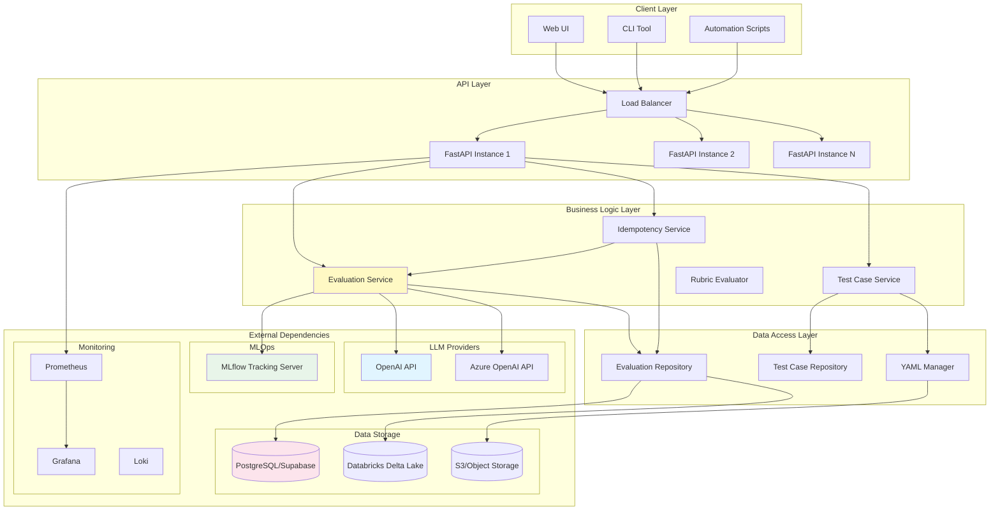
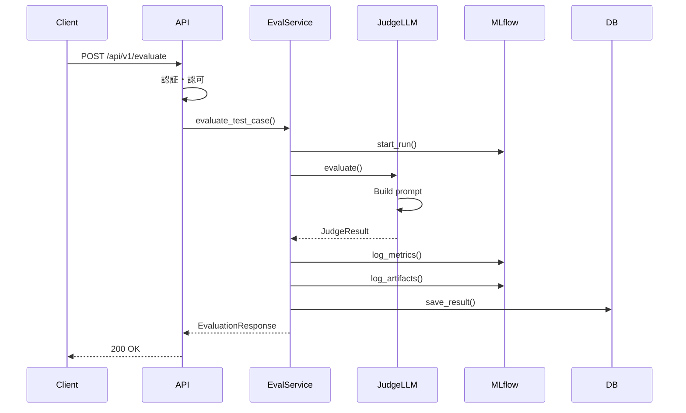

# システムアーキテクチャ

## 概要

LLM-as-a-Judge for Enterprise Systemsは、マイクロサービス指向の論理境界を持つモノリシックアプリケーションとして設計されています。将来的なマイクロサービス化を見据えた疎結合な構造を採用しています。

## 全体アーキテクチャ



## レイヤー構成

### 1. Client Layer（クライアント層）

ユーザーインターフェースとクライアントアプリケーション。

- **Web UI**: React/Next.jsベースの管理画面
- **CLI Tool**: コマンドラインインターフェース
- **Automation Scripts**: CI/CD統合スクリプト

### 2. API Layer（API層）

RESTful APIエンドポイントの提供。

**責務**:
- HTTPリクエストの受付
- 認証・認可
- リクエストバリデーション
- レスポンスフォーマット
- レート制限

**技術スタック**:
- FastAPI
- Pydantic（バリデーション）
- JWT（認証）

### 3. Business Logic Layer（ビジネスロジック層）

コアのビジネスロジックとドメインモデル。

**主要サービス**:

#### Evaluation Service
- Judge LLMによる評価実行
- 評価結果の生成
- MLflowへのログ記録

#### Test Case Service
- テストケースのCRUD操作
- YAMLファイルの管理
- キャッシング

#### Idempotency Service
- 冪等性チェックの実行
- 複数回実行と比較
- variance_score計算

#### Rubric Evaluator
- Rubricベース評価の実行
- Hard Rules + Soft Judgeの統合
- 基準別の詳細評価

### 4. Data Access Layer（データアクセス層）

データの永続化と取得の抽象化。

**パターン**:
- **Repository Pattern**: データベースアクセスの抽象化
- **Factory Pattern**: 環境別の実装切り替え

**実装**:
```python
# Repositoryインターフェース
class BaseRepository(ABC):
    @abstractmethod
    def save_evaluation_result(self, result): pass

# Supabase実装
class SupabaseRepository(BaseRepository):
    def save_evaluation_result(self, result):
        # Supabase固有の実装
        pass

# Databricks実装
class DatabricksRepository(BaseRepository):
    def save_evaluation_result(self, result):
        # Databricks固有の実装
        pass
```

### 5. External Dependencies（外部依存）

システムが依存する外部サービス。

- **LLM Providers**: OpenAI、Azure OpenAI
- **Data Storage**: PostgreSQL、Databricks、S3
- **MLOps**: MLflow Tracking Server
- **Monitoring**: Prometheus、Grafana、Loki

## データフロー

### 評価実行フロー



## 設計原則

### 1. 関心の分離（Separation of Concerns）

各レイヤーは明確に定義された責務を持ち、他のレイヤーの詳細を知らない。

### 2. 依存性の逆転（Dependency Inversion）

高レベルモジュールは低レベルモジュールに依存せず、抽象に依存する。

```python
# ✅ Good: 抽象に依存
class EvaluatorService:
    def __init__(self, repository: BaseRepository):
        self.repository = repository

# ❌ Bad: 具体に依存
class EvaluatorService:
    def __init__(self):
        self.repository = SupabaseRepository()
```

### 3. 単一責任の原則（Single Responsibility）

各クラス・関数は1つの責務のみを持つ。

### 4. 開放閉鎖の原則（Open/Closed）

拡張に対して開いており、修正に対して閉じている。

```python
# 新しいLLMプロバイダーの追加は既存コードの変更なし
class NewProviderLLM(BaseLLM):
    def invoke(self, prompt):
        # 新プロバイダー固有の実装
        pass
```

## スケーラビリティ

### 水平スケーリング

FastAPIインスタンスを複数起動し、ロードバランサーで分散。

```yaml
# Kubernetes Deployment例
replicas: 3
```

### キャッシング戦略

- **テストケース**: インメモリキャッシュ（5分TTL）
- **Judge LLM設定**: Redis（1時間TTL）
- **評価結果**: データベース（永続化）

### 非同期処理

重い処理はバックグラウンドジョブとして実行。

```python
from fastapi import BackgroundTasks

@router.post("/evaluate")
async def evaluate(
    request: EvaluationRequest,
    background_tasks: BackgroundTasks
):
    background_tasks.add_task(
        heavy_evaluation_task,
        request
    )
    return {"status": "processing"}
```

## セキュリティ

### 認証・認可

- **JWT**: トークンベース認証
- **RBAC**: ロールベースアクセス制御
- **API Key**: サービス間認証

### データ保護

- **通信の暗号化**: HTTPS/TLS
- **データベース暗号化**: At-Rest暗号化
- **機密情報マスキング**: ログからのAPIキー除外

### レート制限

```python
from slowapi import Limiter

limiter = Limiter(key_func=get_remote_address)

@app.post("/evaluate")
@limiter.limit("10/minute")
async def evaluate():
    pass
```

## 環境構成

### 開発環境

- **LLM**: OpenAI API
- **DB**: Supabase（PostgreSQL）
- **MLflow**: ローカルファイルシステム

### 本番環境

- **LLM**: Azure OpenAI
- **DB**: Databricks Delta Lake
- **MLflow**: S3バックエンド

### 環境切り替え

```python
# config.py
class Settings(BaseSettings):
    db_provider: str = "supabase"  # or "databricks"
    llm_provider: str = "openai"   # or "azure_openai"

    class Config:
        env_file = ".env"
```

## 将来のマイクロサービス化

現在の論理境界を物理的なサービスに分離可能：

1. **Evaluation Service** - 評価実行
2. **Test Case Service** - テストケース管理
3. **Idempotency Service** - 冪等性チェック
4. **Auth Service** - 認証・認可
5. **API Gateway** - ルーティング・認証

各サービス間の通信はREST APIまたはgRPCで実装。

## 次のステップ

- [データモデル](../design/02_data_models.md) - データ構造の詳細
- [API リファレンス](api/overview.md) - エンドポイント仕様
- [デプロイメント](operations/deployment.md) - 本番環境構築
