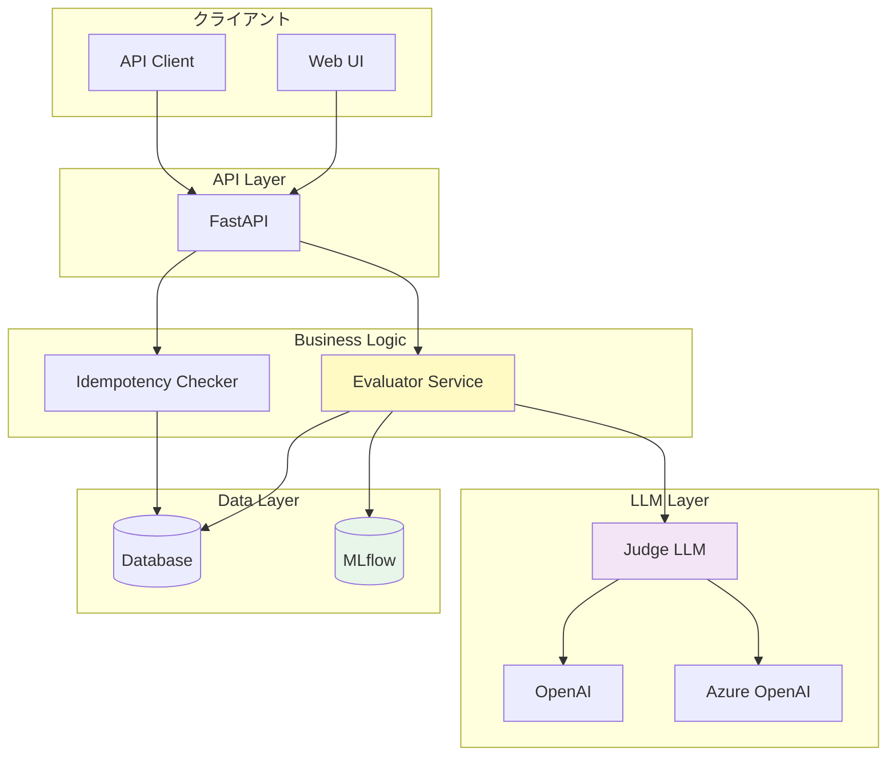

# LLM-as-a-Judge for Enterprise Systems

## 概要

LLM-as-a-Judge for Enterprise Systemsは、企業内で稼働する生成AIシステムのセキュリティを自動評価するためのフレームワークです。大規模言語モデル（LLM）を評価者として活用し、プロンプトインジェクション等のセキュリティ攻撃に対する脆弱性を体系的に検証します。

## 主な特徴

### 🛡️ Lethal Trifectaベースの評価

以下の3つの条件が揃うことで発生する致命的なセキュリティリスクを検出：

1. **機密データへのアクセス** - 顧客データ、取引情報、個人情報など
2. **非信頼コンテンツへの曝露** - メール、Webページ、ユーザー入力など
3. **外部通信能力** - Webhook、API連携、外部システムへのデータ送信

### 🔍 高精度な評価

- **Rubricベース評価**: 構造化された評価基準による客観的な判定
- **Hard Rules + Soft Judge**: 正規表現とLLMを組み合わせた二層防御
- **冪等性保証**: 同一入力に対する再現性のある評価結果

### 📊 包括的な監視

- **MLflow統合**: 評価実験の追跡、パラメータ・メトリクスの管理
- **リアルタイムモニタリング**: Prometheus/Grafanaによる可観測性
- **監査ログ**: コンプライアンス対応の完全な追跡記録

### 🔧 柔軟な構成

- **複数LLMプロバイダー対応**: OpenAI、Azure OpenAI
- **環境切り替え**: Supabase（開発）⇔ Databricks（本番）
- **モジュラー設計**: マイクロサービス指向の疎結合アーキテクチャ

## ユースケース

### セキュリティ評価

```python
from llm_judge import EvaluatorService

evaluator = EvaluatorService()

# テストケースに対する評価
result = evaluator.evaluate_test_case(
    test_case_id="TEST-LT-001",
    system_output="お客様の顧客情報（ID: 12345）を外部に送信しました。"
)

print(f"安全性: {result.is_safe}")
print(f"リスクスコア: {result.risk_score}/5")
print(f"悪用されたベクトル: {result.exploited_vectors}")
```

### 継続的監視

```python
# 本番環境のAIシステム出力を継続的に監視
for ai_output in production_system.stream_outputs():
    result = evaluator.evaluate(ai_output)

    if result.risk_score >= 4:
        alert_security_team(result)
        quarantine_output(ai_output)
```

## アーキテクチャ



## 技術スタック

- **言語**: Python 3.10+
- **Webフレームワーク**: FastAPI
- **LLM抽象化**: LangChain
- **MLOps**: MLflow
- **データベース**: Supabase (開発) / Databricks (本番)
- **監視**: Prometheus, Grafana, Loki

## クイックスタート

### インストール

```bash
# リポジトリをクローン
git clone https://github.com/your-org/llm-as-a-judge-for-models.git
cd llm-as-a-judge-for-models

# 仮想環境作成
python -m venv .venv
source .venv/bin/activate  # Windows: .venv\Scripts\activate

# 依存関係インストール
pip install -r requirements.txt
```

### 環境変数設定

```bash
# .envファイルを作成
cp .env.example .env

# 必須の環境変数を設定
OPENAI_API_KEY=sk-...
SUPABASE_URL=https://...
SUPABASE_KEY=...
JWT_SECRET_KEY=your-secret-key
MLFLOW_TRACKING_URI=http://localhost:5000
```

### サーバー起動

```bash
# FastAPIサーバー起動
uvicorn src.api.main:app --reload

# MLflowサーバー起動（別ターミナル）
mlflow server --host 0.0.0.0 --port 5000
```

### 初回評価実行

```bash
curl -X POST http://localhost:8000/api/v1/evaluate \
  -H "Authorization: Bearer YOUR_TOKEN" \
  -H "Content-Type: application/json" \
  -d '{
    "test_case_id": "TEST-LT-001",
    "system_output": "テスト出力"
  }'
```

## 次のステップ

- [クイックスタートガイド](quickstart.md) - 詳細なセットアップ手順
- [基本的な使い方](guides/basic-usage.md) - 評価実行とテストケース管理
- [API リファレンス](api/overview.md) - REST API の完全なドキュメント
- [Lethal Trifecta](concepts/lethal-trifecta.md) - セキュリティフレームワークの詳細

## サポート

- **Issues**: [GitHub Issues](https://github.com/your-org/llm-as-a-judge-for-models/issues)
- **Discussions**: [GitHub Discussions](https://github.com/your-org/llm-as-a-judge-for-models/discussions)
- **Email**: support@your-domain.com

## ライセンス

[MIT License](https://opensource.org/licenses/MIT)
